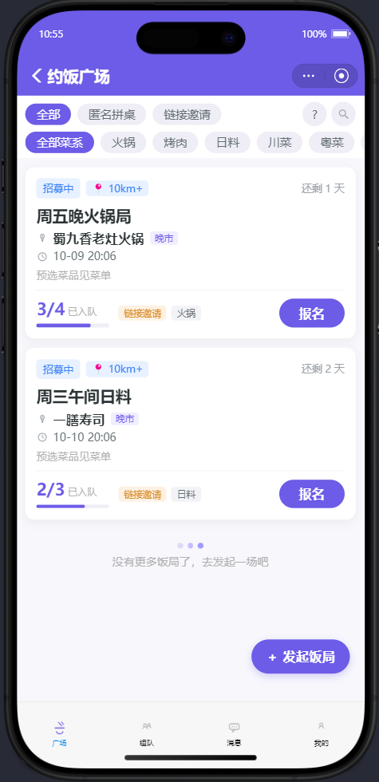
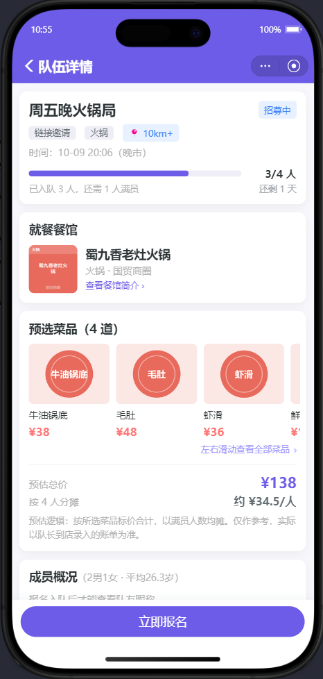
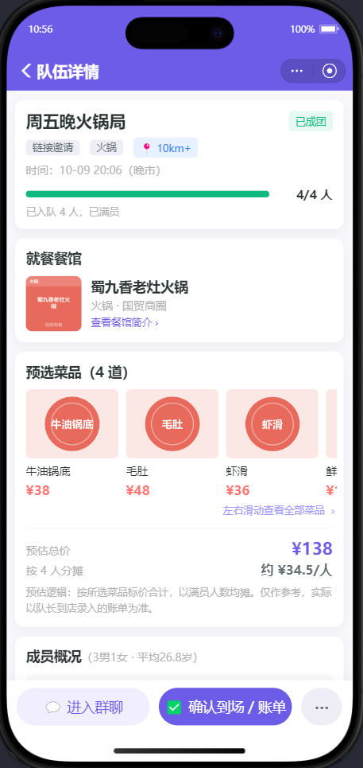

# 约饭组队智能 Agent 系统（MVP）

餐饮平台陌生人/好友混合约饭组队场景：发起组队 → 广场招募 → 自动成团建群 → 到店核销 → 人均分账，全流程由规则驱动的状态机 Agent 自动调度。

## 产品预览

| 约饭广场 | 队伍详情 · 招募中 | 队伍详情 · 已成团 |
|:---:|:---:|:---:|
|  |  |  |
| 模式/菜系/时段多维筛选，卡片一屏尽览 | 预选菜品与预估人均，报名入口常驻 | 成团建群，确认到场后按实际人数分账 |

## 目录

- [架构](#架构) · [核心特性](#核心特性) · [快速开始](#快速开始)
- [页面与体验](#页面与体验) · [全局规范](#全局规范)
- [目录结构](#目录结构) · [配置项](#配置项) · [已知约束](#已知约束) · [变更历史](#变更历史要点)

## 架构

```
支付宝小程序 (uni-app + Vue 3 + Pinia)          ← frontend/
    │ my.request REST(JWT)      my.connectSocket WS
    ▼
FastAPI 单体（单进程单 worker）                  ← backend/
    ├─ api/          REST + WebSocket 路由
    ├─ services/     业务编排
    ├─ agent/        ★ 规则引擎状态机（核心，无 LLM）
    ├─ schemas/      脱敏序列化层（唯一出口）
    └─ workers/      task_queue 消费（WS 广播 outbox）
    ▼
SQLite (WAL) + SQLAlchemy
```

## 核心特性

- **状态机**：`draft → recruiting → formed → completed`（异常终态 `failed`，带归因 `fail_reason`），20 条声明式流转规则，链式自动触发（满员自动成团 / 核销窗口关闭自动锁账单 / 全付清自动归档）；招募超时自动下架
- **餐馆与预选菜单**：队长发起时选定餐馆（16 家模拟餐馆 / 96 道菜），可提前勾选菜品形成预选菜单（含菜品图片），详情页展示菜品网格与预估总价/人均（按满员人数分摊，仅供参考，账单仍由队长到店录入）
- **并发安全**：SQLite WAL + 条件 UPDATE 原子抢名额 + **DB 层 CHECK 约束**兜底，`tests/test_concurrency.py` 验证 10 人并发抢 2 个名额绝不超卖
- **双模式**：匿名拼桌（仅广场报名、禁止主页） / 链接邀请（小程序分享卡片携邀请码直达，成团后可用于补位）
- **到店确认与分账**：确认到场（核销）后按**实际到场人数**均摊，缺席者不参与；核销窗口关闭（全员确认或超过就餐时间 + 宽限期）即锁账，避免一人不来全队卡死
- **隐私与合规**：对外用户形态统一 `UserPublic = {nickname, age, gender}`，`tests/test_privacy.py` 扫描全部响应无姓名/证件/用户名泄漏；非成员看不到成员名单；18 岁门槛 + 证件校验位 + 同意留痕 + 账号注销 + 协议全文页
- **风控**：踢人冷却、跨队拉黑、举报工单与自动限制、群聊内容安全过滤与 2 分钟撤回、全端点限流、敏感操作审计日志
- **支付**：MVP 模拟支付（即时到账），人均分摊、各自独立结账、队长份额补差保账目平衡

## 快速开始

### 1. 启动后端（必须单 worker）

```bash
cd backend
# 使用 venv：C:\Users\Jerry\.workbuddy\binaries\python\envs\default\Scripts\python.exe
python -m pip install -r requirements.txt
python scripts/migrate_20261007.py            # 先在库副本上演练结构变更
python scripts/migrate_20261007.py --apply    # 确认后应用（自动备份到 .backup/）
python run.py          # http://127.0.0.1:8000，单进程
```

（可选）灌入演示数据：`python scripts/seed.py`（16 家餐馆 + 96 道菜 + 5 支不同状态的队伍）

### 2. 运行测试

```bash
cd backend
python -m pytest tests/ -q     # 108 个用例
```

### 3. 打开小程序

```bash
cd frontend
npm install
npm run build:mp-alipay
```

用「支付宝小程序开发者工具」导入 `frontend/dist/build/mp-alipay`（开发调试可用 `npm run dev:mp-alipay` 持续编译）。

**配置**：
- IDE 内「详情 → 本地设置」关闭域名校验（开发期直连 `http://127.0.0.1:8000`）
- 登录走 mock 模式（`mock:<账号名>`），无需支付宝 AppID
- 「我的 → 演示工具」可切换测试账号，单台模拟器即可扮演队长/队员多角色

### 4. 演示

照 `docs/demo-script.md` 走完整业务闭环（约 8 分钟）。

## 页面与体验（2026-10-08 优化 + 二轮打磨）

| 页面 | 关键能力 |
|---|---|
| 约饭广场 | **筛选压缩为两行**：第一行模式单选（全部·匿名拼桌·链接邀请），第二行菜系 / 时段 / 距离 / 排序横滑，其中**菜系与时段支持多选**（同维度并集、跨维度交集），并有"已筛选 N 项 / 清空"回执；卡片信息归一行（状态·距离·剩余招募时长），餐馆名与时间分级显示，已满置灰且按钮禁用并标注「已满」；列表到底有轻量收尾插画；悬浮发起按钮阴影收紧；下拉刷新 + 上拉加载；整卡可点进详情 |
| 队伍详情（招募中） | 进度条右侧人数与倒计时**分行**，并给出"还需 N 人满员"；菜品横向滚动 + **溢出箭头提示**、卡片尺寸与价格对齐；预估费用给出**预估逻辑小字**；匿名模式写明"入队后才能看到队友昵称"；**餐馆卡片可点击进餐馆简介**；报名按钮常驻底部 + 规则二次确认；用餐时间已过则锁定报名 |
| 队伍详情（已成团） | 底部两个主按钮（**进入群聊｜确认到场·账单**）+ **⋯ 更多菜单**收纳退出/解散（防止误点）；成员列表**队长头像与标签高亮**；队长踢人二次确认；菜品区横滑箭头提示 |
| 我的组队 | Tab 分段（招募中 / 已成团 / 已结束），角标以**上标**形式挂在文字右上角；**复用广场同一张卡片**，全站视觉统一；**已成团但未核销 = 有效进行中，卡片保持白底可点，只有已结束 / 已取消才置灰弱化**；卡片含饭局名 / 门店 / 就餐时间 / 距离 / **人数进度条** / 标签 + 匿名模式说明；整卡可点进详情 |
| 消息通知 | **类型头像**（报名者首字 / 满员 🎉 / 账单 💰 / 提醒 ⏰ 等）；标题加粗、正文浅灰；未读红点 + 左侧竖线，**已读不降透明度**（保持正常可读）；**「查看 / 去处理」与「删除」并排在卡片右下操作区**（不再用左滑，彻底避免与文字重叠）；整条卡片可点进详情 |
| 我的 | 用户信息卡片状态标签靠右；对外资料与实名说明精简为小字；**资料预览弹窗**保留；历史饭局入口带箭头；保存成功 toast |
| 餐馆简介（新增页） | 头图 + 菜系 / 商圈 / 人均 + 简介 + 菜品清单；底部「以此为餐馆发起饭局」一键带入发起页 |
| 发起约饭 | **预选菜品与文字备注合并为一个模块**；目标人数数字加大 + "最少 2 人"提示；选中餐馆后**自动带出菜系与商圈**（不再需要手填，仅在餐馆未标注菜系时兜底手填）；**字段级红色错误提示**；基本信息与组队模式两大区块留白分隔；必填未完成按钮置灰 |
| 队伍群聊 | 顶部固定公告（饭局名 / 餐馆 / 用餐时间）；**图片发送**（可发餐馆定位截图）；**@全体成员（仅队长）**；输入框适配键盘与手势条 |
| 核销与账单 | 到场确认与账单**两张独立卡片**；**仅队长可录入/修改账单**；核销码放大 + 一键复制；到场状态配色；问号弹规则说明；账单生效后按实际到场人数给出各自应付金额与支付入口 |

## 全局规范

- **主色**：紫色 `#6c5ce7`；状态色标准化——**蓝=进行中（招募中）/ 绿=完成（已成团）/ 灰=失效（已终止）/ 红=危险（删除·解散）/ 浅橙=提示（注意事项）**
- **条目"有效 / 失效"视觉口径**：有效状态（含已成团未核销、满员待开场）一律正常白底高亮、点击有按压反馈；只有已结束 / 已取消才降透明度 + 灰度弱化（广场语境下"满员 / 招募已截止"因无位可报而随卡片一起弱化并禁用按钮）
- **字号层级**：标题 36 / 小节 30 / 正文 28 / 辅助 24 / 弱化 22
- **卡片**：圆角 `20rpx`，阴影 `0 6rpx 20rpx rgba(45,52,54,.06)`，页面左右边距 `20rpx`
- **统一组件态**：加载态（`.loading-block` 转圈）、列表底部（`.list-foot`）、横滑溢出提示（`.scroll-hint`）；所有可点元素有按压反馈，请求中统一置灰防重复提交
- **安全区适配**：底部固定栏使用 `env(safe-area-inset-bottom)` 适配手势条；吸顶/顶部区域使用 `env(safe-area-inset-top)`（原生导航栏下为 0，改为自定义导航栏时自动补状态栏高度）
- **图片**：列表图片启用 `lazy-load` + 分页加载

## 目录结构

```
backend/
├── app/
│   ├── agent/        # states / events / transitions / guards / effects / engine / concurrency
│   ├── api/          # auth users plaza restaurants teams chat checkin bills notifications reports ws
│   ├── core/         # config / deps / security / timeutil / idcard / text_guard / ratelimit / audit / idempotency
│   ├── models/       # 17 张表（含 restaurants / dishes 参考数据，audit_logs / reports / push_outbox / team_member_events / user_blocks / idempotency_keys）
│   ├── schemas/      # serializers（脱敏出口）/ requests
│   ├── services/     # 业务编排
│   ├── workers/      # task_worker（outbox 消费）
│   └── main.py
├── scripts/          # seed.py + menu_catalog.json + migrate_20261007.py（结构迁移）
├── tests/            # auth teams restaurants state_machine concurrency checkin_bill ws privacy audit_fixes
└── .backup/          # 数据库备份（迁移/修复前自动留存）
frontend/             # uni-app（mp-alipay），pages × 13（新增 restaurant-detail 餐馆简介页）；static/food 菜品图由 scripts/gen_food_images.py 生成
docs/                 # api.md / state-machine.md / demo-script.md / 审查报告 / 整改报告 / 产品截图（p1-p3.png）
```

## 配置项（`DP_` 前缀环境变量，或 backend/.env）

| 变量 | 默认 | 说明 |
|---|---|---|
| `DP_ENV` | `dev` | 设为 `prod` 会强制校验危险默认值（见下） |
| `DP_JWT_SECRET` | 示例值 | **生产必须替换** |
| `DP_ID_HASH_PEPPER` | 示例值 | 证件号 HMAC 摘要的服务端密钥，生产必须替换 |
| `DP_MOCK_ALIPAY` | `true` | mock 登录开关；prod 下为 true 会拒绝启动 |
| `DP_REALNAME_MODE` | `mock` | `mock`=仅本地格式校验；`kyc`=接入权威核验（待实现） |
| `DP_CORS_ORIGINS` | `*` | 逗号分隔白名单；prod 下为 `*` 会拒绝启动 |
| `DP_TIMEZONE_OFFSET_HOURS` | `8` | 业务时区偏移 |
| `DP_CONSENT_VERSION` | `1.0` | 协议版本号，协议文本变更时递增 |
| `DP_CHECKIN_GRACE_HOURS` | `2` | 就餐后多久未确认到场即视为缺席并按到场人数锁账 |
| `DP_RECRUITING_EXPIRE_GRACE_HOURS` | `2` | 就餐后多久仍未满员即自动关闭 |
| `DP_REMINDER_STAGE2_HOURS` / `STAGE3_HOURS` | `12` / `24` | 到场超时阶梯提醒的二级/三级时点 |
| `DP_REPORT_AUTO_RESTRICT_THRESHOLD` | `5` | 被举报累计达此值自动限制（0=关闭） |
| `DP_PUSH_PROVIDER` | `none` | 订阅消息通道；`none` 时只落库排队（未接正式 AppID 的正确降级） |
| `DP_RATE_LIMIT_*` | 见 config | 各维度每分钟限流阈值（`DP_RATE_LIMIT_ENABLED=false` 可整体关闭） |

生产启动前置检查（`settings.assert_production_ready`）会在 `DP_ENV=prod` 且存在
危险默认值时**直接拒绝启动**：默认 JWT 密钥、默认 pepper、`MOCK_ALIPAY=true`、`CORS_ORIGINS=*`。

## 已知约束（MVP）

- 后端必须单进程单 worker（SQLite 写串行 + 进程内 WS 管理器 + 进程内限流计数）
- WS 已改首帧鉴权（不再把 token 放进 URL），旧 `?token=` 方式仅为兼容保留
- **实名仅为"本地格式校验 + 摘要留痕"，未接入权威核验**：产品文案已如实标注为「实名登记」；
  正式版本需接支付宝实名/运营商三要素。`DP_REALNAME_MODE=kyc` 为预留开关
- 支付为模拟（生产接 `my.tradePay`）
- 订阅消息未接入：高时效事件已写入 `push_outbox` 排队，接正式 AppID 后实现 provider 即可发出
- 内容安全为内置词表（生产应替换为云内容安全服务 + 运营可维护词库）
- 多实例部署需把 WS 广播与限流迁到 Redis（当前为进程内实现）
- 真机预览需正式 AppID + HTTPS 合法域名

## 变更历史要点

- 2026-10-08 第二轮复审整改：WS 踢人/退队即时断订（堵聊天泄漏窗口）、成团后退队成员补位复活（不再误报 409）、巡检查询下推时间下限、前端 403 判空；回归用例增至 108 个
- 2026-10-07/08 全量审查整改（41 条）：见 `docs/约饭组队-整改报告-20261008.md`；
  审查原文见 `docs/约饭组队-审查报告-20261007.md`
- 数据库结构变更需执行 `backend/scripts/migrate_20261007.py --apply`（幂等，自动备份）
